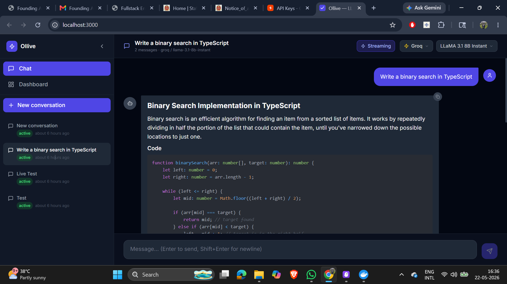
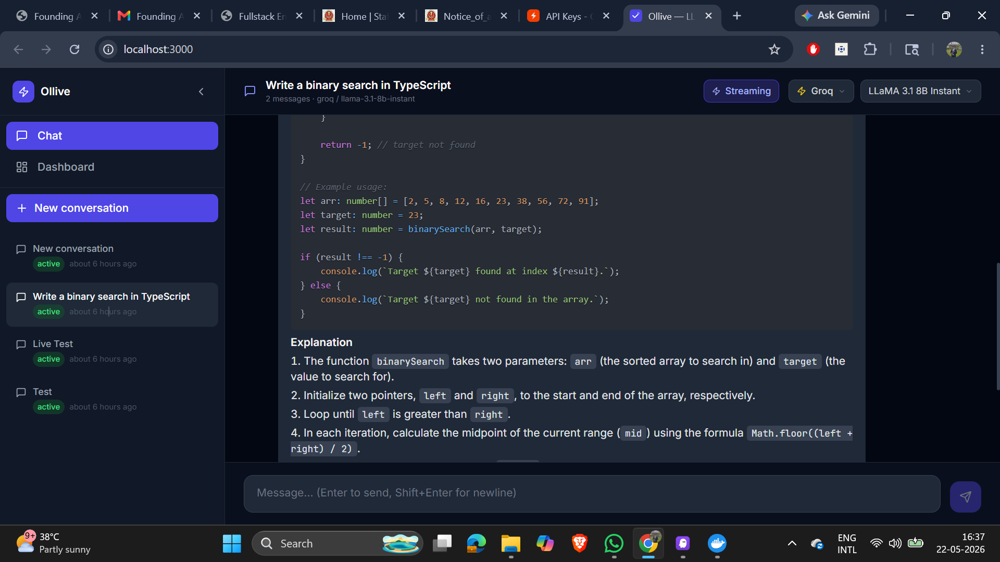
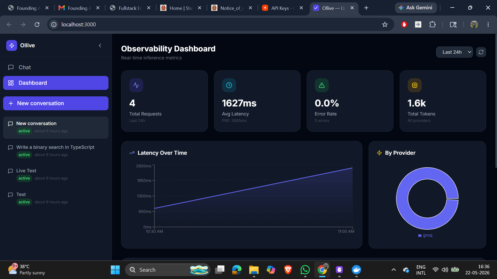

# Ollive LLM Platform

A production-grade inference logging and ingestion system for LLM applications — built with a focus on observability, multi-provider support, streaming responses, and developer experience.

---

## Screenshots

### Chat — Streaming Response with Syntax Highlighting


The chat interface renders full markdown — code blocks with syntax highlighting, numbered lists, inline code, tables. Provider and model are selectable per conversation. Streaming mode shows tokens in real time.

### Chat — Code Continuation


Long responses scroll naturally. The assistant bubble renders structured content cleanly — headers, code, explanations all formatted correctly.

### Observability Dashboard


Real-time metrics auto-refresh every 30 seconds:
- **4 requests**, avg latency **1627ms**, P95 **3065ms**, **1.6k tokens**
- Latency over time area chart
- Provider distribution pie chart (Groq 100%)
- Per-provider performance table
- Recent inference log feed

---

## Quick Start (One Command)

```bash
# 1. Clone the repo
git clone https://github.com/shivavadtyavath/Ollive-LLM-Platform.git
cd Ollive-LLM-Platform

# 2. Add your Groq API key (free at console.groq.com)
echo "GROQ_API_KEY=your_key_here" >> backend/.env

# 3. Start everything
docker compose up --build

# 4. Open the app
# Frontend:  http://localhost:3000
# API docs:  http://localhost:8000/docs
```

That's it. PostgreSQL, Redis, backend API, and frontend all start together.

---

## Architecture Overview

```
┌─────────────────────────────────────────────────────────────────┐
│                        Browser (React)                          │
│  ┌──────────────┐  ┌──────────────┐  ┌──────────────────────┐  │
│  │  Chat UI     │  │  Sidebar     │  │  Dashboard           │  │
│  │  (streaming) │  │  (conv list) │  │  (metrics/charts)    │  │
│  └──────┬───────┘  └──────────────┘  └──────────────────────┘  │
└─────────┼───────────────────────────────────────────────────────┘
          │ HTTP / SSE
┌─────────▼───────────────────────────────────────────────────────┐
│                    FastAPI Backend (Python)                      │
│                                                                 │
│  ┌─────────────────┐   ┌──────────────────┐                    │
│  │  Chat API        │   │  Ingestion API   │                    │
│  │  /conversations  │   │  /ingest/log     │                    │
│  └────────┬────────┘   └────────┬─────────┘                    │
│           │                     │                               │
│  ┌────────▼─────────────────────▼─────────┐                    │
│  │           LLM SDK Wrapper               │                    │
│  │  • Multi-provider (Groq/Ollama/OpenAI)  │                    │
│  │  • Captures: latency, tokens, status    │                    │
│  │  • PII redaction before logging         │                    │
│  │  • Fire-and-forget async log shipping   │                    │
│  └────────────────────┬────────────────────┘                    │
│                       │                                         │
│  ┌────────────────────▼────────────────────┐                    │
│  │         In-Process Event Bus             │                    │
│  │  publish("inference_log", payload)       │                    │
│  │  → async handler → DB write             │                    │
│  └────────────────────┬────────────────────┘                    │
└───────────────────────┼─────────────────────────────────────────┘
                        │
          ┌─────────────┼─────────────┐
          ▼             ▼             ▼
     PostgreSQL       Redis        Ollama
   (persistent)    (sessions)   (local LLMs)
```

### Ingestion Flow

1. User sends a message → Chat API receives it
2. SDK wrapper calls the LLM provider (Groq / Ollama / OpenAI / OpenRouter)
3. While streaming/returning the response, SDK captures: start time, end time, token counts, status
4. SDK fires `POST /api/v1/ingest/log` **asynchronously** (fire-and-forget, never blocks the response)
5. Ingestion API validates the payload and publishes to the internal event bus
6. Event bus handler persists the log to PostgreSQL with PII redaction applied
7. Dashboard polls `/api/v1/metrics/*` for aggregated stats

### Why Event Bus?

The ingestion path is fully decoupled from the chat path. A slow DB write never delays the user's response. In production, the in-process `asyncio.Queue` would be replaced by Redis Streams or Kafka — the interface is identical.

---

## Features

### Core
- Multi-turn conversations with configurable context window
- Cancel / resume / delete conversations from the sidebar
- List all conversations with status badges and timestamps
- Auto-title from first message

### Multi-Provider Support
| Provider | Free | Models |
|----------|------|--------|
| **Groq** | ✅ | LLaMA 3.1 8B Instant, LLaMA 3.3 70B, Mixtral 8x7B, Gemma 2 9B |
| **Ollama** | ✅ | LLaMA 3, Mistral, Phi-3, Gemma (fully local) |
| **OpenRouter** | ✅ | Mistral 7B, LLaMA 3 8B, Gemma 7B (free tier) |
| **OpenAI** | ❌ | GPT-4o Mini, GPT-3.5 Turbo |

### Streaming
- Server-Sent Events (SSE) for real-time token streaming
- Toggle between streaming and batch mode per message
- Streaming flag captured in inference logs

### Observability Dashboard
- Total requests, avg latency, P95 latency, error rate, total tokens
- Latency over time (area chart, configurable time window)
- Provider distribution (donut chart)
- Per-provider performance table (requests, success rate, avg latency, tokens)
- Recent inference logs with status, latency, token counts
- Auto-refreshes every 30 seconds

### PII Redaction
Applied before storing any log preview — original message preserved for the user, redacted copy stored in analytics:
- Email addresses → `[EMAIL]`
- Phone numbers → `[PHONE]`
- Credit card numbers → `[CARD]`
- SSNs → `[SSN]`
- IP addresses → `[IP]`
- API keys / long tokens → `[TOKEN]`

---

## Schema Design

### `conversations`
```sql
id          UUID PRIMARY KEY
title       VARCHAR(255)          -- auto-set from first message
status      ENUM(active, cancelled, archived)
provider    VARCHAR(64)
model       VARCHAR(128)
created_at  TIMESTAMP
updated_at  TIMESTAMP
```

### `messages`
```sql
id               UUID PRIMARY KEY
conversation_id  UUID FK → conversations (CASCADE DELETE)
role             ENUM(user, assistant, system)
content          TEXT          -- original content shown to user
content_redacted TEXT          -- PII-redacted copy for analytics
token_count      INTEGER
created_at       TIMESTAMP
```

### `inference_logs`
```sql
id                UUID PRIMARY KEY
conversation_id   UUID FK → conversations (CASCADE DELETE)
provider          VARCHAR(64)
model             VARCHAR(128)
started_at        TIMESTAMP
ended_at          TIMESTAMP
latency_ms        FLOAT
prompt_tokens     INTEGER
completion_tokens INTEGER
total_tokens      INTEGER
status            VARCHAR(32)   -- success | error | timeout
error_message     TEXT
http_status_code  INTEGER
input_preview     TEXT          -- truncated (300 chars) + PII-redacted
output_preview    TEXT          -- truncated (300 chars) + PII-redacted
is_streaming      BOOLEAN
metadata          JSONB         -- flexible extra fields (log_id, sdk_version)
created_at        TIMESTAMP
```

**Design decisions:**
- Separate `messages` and `inference_logs` tables — messages are the conversation record, logs are the observability record. They share `conversation_id` but serve different purposes and have different retention/access patterns.
- `content_redacted` stored alongside `content` — original preserved for the user, redacted copy for analytics/export pipelines.
- `metadata JSONB` on inference_logs — flexible escape hatch for provider-specific fields without schema migrations.
- Soft-delete via `status` on conversations — never hard-delete user data by default.
- `CASCADE DELETE` on foreign keys — deleting a conversation cleans up all its messages and logs atomically.

---

## Tradeoffs

| Decision | Tradeoff |
|----------|----------|
| In-process event bus | Simple, zero dependencies. In production: replace with Redis Streams for durability across restarts |
| Regex PII redaction | Fast, no dependencies. Misses context-dependent PII (names, addresses). Production: use spaCy NER |
| SSE for streaming | Works everywhere, no WebSocket handshake. Unidirectional only — fine for chat |
| asyncpg + SQLAlchemy async | Best async PostgreSQL performance. Slightly more complex than sync ORM |
| Single FastAPI service | Simple to deploy. At scale: split chat API and ingestion API into separate services |
| UTC naive datetimes | Simpler DB storage. Production: use timestamptz throughout |

---

## What I'd Improve With More Time

1. **Message queue durability** — Replace in-process event bus with Redis Streams. Logs survive restarts and can be replayed on failure.
2. **Batched DB writes** — Buffer inference logs in Redis and flush in batches of 50 every 5 seconds. Reduces DB pressure at scale.
3. **WebSocket support** — Bidirectional streaming for typing indicators and real-time collaborative features.
4. **Rate limiting** — Per-user/per-provider rate limits with Redis token buckets.
5. **Auth** — JWT-based auth with conversation ownership. Currently all conversations are shared.
6. **Kubernetes manifests** — Helm chart with HPA for the backend, separate ingestion worker deployment.
7. **Alerting** — Webhook alerts when error rate exceeds threshold or P95 latency spikes.
8. **Export** — CSV/JSON export of inference logs for offline analysis.
9. **Cost tracking** — Estimated cost per request based on provider pricing tables.
10. **Prompt templates** — Saved system prompts per conversation for consistent personas.

---

## Architecture Notes

### Logging Strategy
- Every LLM call is wrapped by the SDK regardless of provider
- Logs are shipped asynchronously — **never on the critical path**
- Failures in log shipping are silently swallowed (logged at DEBUG level only)
- PII redaction happens before any data leaves the application boundary
- Input/output previews are truncated to 300 characters before storage

### Scaling Considerations
- **Horizontal scaling**: Backend is stateless — run N replicas behind a load balancer
- **DB bottleneck**: Add read replicas for metrics queries; write path stays on primary
- **Ingestion throughput**: At 1000 req/s, switch to batched writes + Redis buffer
- **Event bus**: Replace `asyncio.Queue` with Redis Streams for multi-instance deployments
- **Frontend**: Static build served by nginx — scales to any CDN

### Failure Handling
- **DB unavailable**: Ingestion fails silently, chat still works (logs are best-effort)
- **LLM provider down**: Error captured in inference log with HTTP status code, user sees friendly error message
- **Redis unavailable**: Session cache misses gracefully, falls back to DB
- **Partial stream failure**: Error logged, partial response preserved in DB
- **Ingestion endpoint down**: SDK swallows the error after 5s timeout — never affects user

---

## Services

| Service | URL | Description |
|---------|-----|-------------|
| Frontend | http://localhost:3000 | React chat UI + dashboard |
| Backend API | http://localhost:8000 | FastAPI REST + SSE |
| API Docs | http://localhost:8000/docs | Auto-generated Swagger UI |
| API Redoc | http://localhost:8000/redoc | Alternative API docs |
| Ollama | http://localhost:11434 | Local LLM server (optional) |

---

## Setup Instructions

### Prerequisites
- Docker + Docker Compose
- A free Groq API key — https://console.groq.com (takes 30 seconds)

### Environment
```bash
cp backend/.env.example backend/.env
# Edit backend/.env — set GROQ_API_KEY
```

### Run
```bash
docker compose up --build
```

### Pull a local model (optional — for Ollama provider)
```bash
docker compose --profile local up   # starts Ollama
docker compose exec ollama ollama pull llama3
```

### Development (without Docker)
```bash
# Backend
cd backend
pip install -r requirements.txt
cp .env.example .env
# Set DATABASE_URL to a local postgres instance
uvicorn app.main:app --reload --port 8000

# Frontend
cd frontend
npm install
npm run dev   # http://localhost:5173
```

---

## Tech Stack

| Layer | Technology |
|-------|-----------|
| Frontend | React 18, TypeScript, Tailwind CSS, Zustand, Recharts |
| Backend | Python 3.12, FastAPI, SQLAlchemy (async), asyncpg |
| Database | PostgreSQL 16 |
| Cache | Redis 7 |
| LLM | OpenAI-compatible SDK (Groq, Ollama, OpenRouter, OpenAI) |
| Infra | Docker Compose, Nginx, Kubernetes, Kustomize |
| Streaming | Server-Sent Events (SSE) |
| CI/CD | GitHub Actions |

---

## Kubernetes — Self-Hosted Deployment

Full k8s manifests are in the [`k8s/`](./k8s/) directory using Kustomize with dev and prod overlays.

```
k8s/
├── base/              # shared manifests (deployments, services, HPA, ingress)
├── overlays/dev/      # single replica, NodePort, debug mode
└── overlays/prod/     # 3 replicas, TLS ingress, HPA (2→10 pods)
```

### One-command deploy to self-hosted k8s

```bash
# Dev (minikube / k3s)
./k8s/deploy.sh dev
# → Frontend: http://<node-ip>:30080
# → API Docs: http://<node-ip>:30800/docs

# Prod
./k8s/deploy.sh prod
```

### What's included
- **Namespace** isolation (`ollive`)
- **Secrets** management (Groq API key, DB password)
- **Init containers** — backend waits for postgres + redis to be healthy before starting
- **HPA** — backend autoscales 2→10 pods based on CPU (70%) and memory (80%)
- **Rolling updates** — zero-downtime deploys (`maxUnavailable: 0`)
- **Health checks** — liveness + readiness probes on all services
- **Resource limits** — CPU and memory requests/limits on every container
- **Persistent storage** — 5Gi PVC for PostgreSQL
- **Ingress** — nginx with SSE/streaming support (`proxy-buffering: off`)
- **TLS** — cert-manager integration for HTTPS in prod
- **CI/CD** — GitHub Actions builds images and deploys on every push to main

See [`k8s/README.md`](./k8s/README.md) for full setup instructions.
